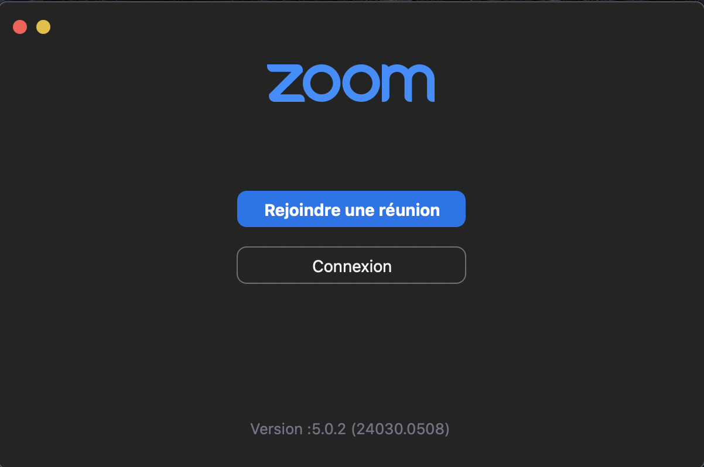

Avant propos : vous retrouverez un bon nombre de tutoriels officiels [ici](https://support.zoom.us/hc/fr/articles/206618765-Didacticiels-vidéos-Zoom)

# Zoom

>© Icône officielle de l'application

# Qu'est ce que Zoom

Zoom est un logiciel de visioconférence très utilisé dans le milieu professionel et parfois pour des cours à l'INSA de Lyon.
Cet outil est très pratique lors de grandes réunion de type amphithéâtre et lorsque la vidéo est nécessaire (les autres outils étant principalement basé sur la VoIP et non sur la vidéoconférence).
Cependant, la durée des réunion est limitée (à 4h avec vos identifiants INSA normalement).
De plus, zoom est assez simple d'utilisation.

# Installation

Vous trouverez les executables sur [la page de téléchargement](https://zoom.us/fr-fr/zoomrooms/software.html).

# Modes d'utilisation

## Rejoindre une conférence

Pour rejoindre une réunion, soit vous avez reçu un lien pour rejoindre directement, cliquez dessus et zoom s'ouvre automatiquement.

Sinon, vous pouvez rejoindre en cliquant sur "Rejoindre une conférence"

Saisissez ensuite l'ID de la réunion.

## Créer une conférence

Il faut créer un compte.
Ensuite vous pouvez créer une conférence.

# Configuration

Je vous conseil d'aller dans les paramètres (zoom.us > Préférences) et de modifier les maramètres audio et vidéo.

## Catégorie audio

Veillez à bien cocher "Désactiver le son du microphone lors de la particiation à une réunion"

## Catégorie vidéo

Veillez à bien cocher "Désactiver ma vidéo lorsque je rejoins une réunion"

